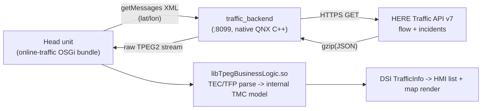

# MHI2 HERE Online Traffic — How It All Works

End-to-end engineering guide for restoring live online traffic on an **Audi MHI2
(CLU7, QNX 6.5 / ARMv7le, Tegra2 T30)** head unit using **HERE Traffic API v7**
as the data source, re-encoded into the **TPEG2** stream the factory decoder
(`libTpegBusinessLogic.so`) already understands.

This document explains *how we do everything*: the pipeline, the build/deploy
loop, the TPEG byte format we reverse-engineered, the on-car diagnostics
(esotrace), and the current known ceilings. It is the practical companion to the
findings log in `/memories/repo/tpeg-capture.md`.

---

## 1. The big picture



Two cooperating pieces:

1. **Bundle patch** ([PatchOnlineTraffic.java](PatchOnlineTraffic.java)) — rewrites
   the factory online-traffic OSGi bundle so the session initialises with a
   working country and the traffic feed is redirected to our local server with
   AES disabled (wire protocol becomes plain `gzip(XML)` request / raw TPEG
   response).
2. **Native backend** ([backend/traffic_backend.cpp](backend/traffic_backend.cpp))
   — a small HTTP server on `:8099` that receives the head unit's `getMessages`
   POST (carrying the car's lat/lon), fetches HERE flow + incidents, and
   re-encodes them into TPEG2.

The head unit's decoder is **native, not Java** — there is no Java byte parser.
`libTpegBusinessLogic.so` parses TEC/TFP and converts to an internal TMC model;
the HMI list only ever sees already-resolved `TrafficInfo` strings over DSI.

---

## 2. Runtime toggle & data path

- **Backend flag file:** `/mnt/persist/traffic_backend_here` present → HERE
  backend active. Absent → car falls back to native TomTom.
- Backend serves `:8099`, logs to `/tmp/traffic_backend.log`. The JVM polls
  roughly every 120–180 s and respawns the backend after a deploy.
- Each poll: HU POSTs its position → backend fetches HERE → returns ~30–40 KB
  TPEG → decoder parses → list + map update.

HERE request (see [backend/here_fetch.cpp](backend/here_fetch.cpp)):

```
GET /v7/{flow|incidents}?in=circle:LAT,LON;r=50000&locationReferencing=tmc,olr&apiKey=KEY
Host: data.traffic.hereapi.com
Accept-Encoding: gzip
```

We request **both** `tmc` and `olr` location referencing. TMC is the only path
that reliably renders on this unit (see §7).

---

## 3. Build / deploy loop

All commands run from [backend/build.sh](backend/build.sh):

| Command | What it does |
|---------|--------------|
| `./build.sh host-build` | Mac clang build (brew `mbedtls@3`). Produces `/tmp/traffic_backend`. |
| `./build.sh compile` | ARM cross-compile via the QNX SDP 6.5 QEMU VM. `EXIT:0` → `build/traffic_backend` (~760 KB ARM ELF). |
| `./build.sh enc-test` | Host encoder round-trip (validates TPEG grammar/CRCs). |
| `./build.sh deploy` | `scp` binary + `here.key` to the car (prints `key_ok`/`deploy_ok`). |

Host dump (one-shot, no car needed):

```bash
DYLD_LIBRARY_PATH=/opt/homebrew/opt/mbedtls@3/lib \
  /tmp/traffic_backend -D <lat> <lon> /tmp/out.tpg -k ../here.key
```

**QNX gcc is old (C89):** no designated array initializers, declarations at block
top. The cross-compiler rejects modern C — keep the code C89-clean.

**Car access:** SSH/SCP alias `mhi2w` → `root@10.173.189.1` (no password). `scp`
**requires `-O`** (legacy protocol). `/tmp` is a symlink to `/dev/shmem`.
`od`/`strings` are unreliable on-device — pull files and inspect on the host.

---

## 4. TPEG2 stream format (reverse-engineered, byte-exact)

The stream is validated against the **TISA TPEG2 evaluation kit** parser and
byte-compared to native TomTom captures. Layers, outermost first:

### Transport frame
```
FF 0F | svcFrameLen(2 BE) | hdrCRC(2 BE) | type=01 | SID(3) | EncID(1) | component-frames...
```
- `svcFrameLen` = total − 7.
- `hdrCRC` = TISA `TPEG_CRC` over `[FF,0F,lenHi,lenLo,type]` + first `min(11,len)`
  payload bytes (a **header-only** CRC — this is why whole-frame CRC searches
  failed for days).
- **Hard limit:** the 16-bit length means one transport frame's payload must be
  **< 65535 bytes**. Overflow silently corrupts the length and the whole stream
  is dropped.

### Component frame (per SNI / TEC / TFP block)
```
SCID(1) | fieldLen(2 BE) | hdrCRC(2 BE) | field[fieldLen]
```
- `SCID 0` = SNI (service/naming), `1` = TEC (incidents), `2` = TFP (flow).
- `hdrCRC` = `TPEG_CRC([SCID,lenHi,lenLo] + field[:min(13,fieldLen)])`.
- TEC/TFP field = `groupPriority(00) | msgCount(1) | messages | dataCRC(2 BE)`,
  where `dataCRC = TPEG_CRC(field[:-2])`.
- **`msgCount` is 1 byte → max 255 messages per frame.** We cap flow at 250/frame
  and emit **two** SCID=2 frames to reach ~500 (see §6).

### TISA CRC (the checksum that unblocked everything)
```python
def TPEG_CRC(data):
    crc = 0xFFFF
    for b in data:
        tmp = ((crc << 8) | (crc >> 8)) & 0xFFFF
        crc = (tmp ^ b) & 0xFFFF
        crc ^= (crc & 0x00FF) >> 4
        tmp = ((crc & 0x00FF) << 8) | ((crc & 0x00FF) >> 8)
        crc = ((crc ^ (tmp << 4)) ^ ((crc & 0x00FF) << 5)) & 0xFFFF
    return crc ^ 0xFFFF
```

### TEC message (incident)
```
00 | CompLen | 00 | MMC | Event | LRC
MMC   = 01 | len | attrlen | msgID(varint) | ver(u8) | expiry(u32 BE) | flag(00 real / 40 cancel)
Event = 03 | len | attrlen | effectCode | 08 | selector(BitArray) | <present attrs> | 04 04 03 | mainCause | warnLevel | dcFlag
LRC   = TMC (method 02) or OLR (method 08)
```
- **Selector BitArray** (byte after `effectCode 08`) chooses which attrs follow:
  `0x40 startTime, 0x20 stopTime, 0x10 tendency, 0x08 lengthAffected, 0x04
  avgSpeed, 0x02 delay, 0x01 segSpeedLimit`, `0x80` = continuation.
- **We emit `0x68` (start | stop | lengthAffected)** with `startTime = genTime`
  and `stopTime = genTime + 3600`. Emitting *no* times made the HU default
  `start == stop == now` → zero validity window → `ExpiryTimeFilter` dropped
  every message (the classic "empty list" bug).

### TMC location container (the path that renders)
```
02 0a 00 02 07 06 | loc16(BE) | cc | ltn | flags | extent
```
- `cc` = country (CZ = `0x02`), `ltn` = table number (25 = `0x19`).
- `flags` = `0x10` base; bit `0x40` = direction (`0x50` = dir 1); bit `0x02`
  (`0x12`/`0x52`) = a secondary/extended location follows (+4 bytes; we use the
  simple 7-byte form).
- `extent` = number of TMC steps (1..30).
- **Direction is inverted vs HERE:** HERE `queuingDirection "+" → 1, "-" → 0`
  (fixed at source in `here_source.c` so the flags byte *and* chain-primary
  selection stay consistent).

### TFP message (flow)
```
comp06 FlowMatrix{startTime, optSel, spatialRes=00 TMCLocations}
  -> comp07 FlowVector{timeOffset=00, count, sections..., trailer=00}
       section = spatialOffset(=extent) | statusSel=0x70 | LOS | avgSpeed(km/h) | freeFlowTravelTime(varint s) | sectionSel=00
comp02 TMC LRC   (identical bytes to the incident TMC path)
```
- **LOS** from HERE `jamFactor`: `<2 free(1), <4 heavy(2), <6 slow(3), <8
  queuing(4), <10 stationary(5), else no-flow(6)`.
- `avgSpeed = speed_ms * 3.6`; `freeFlowTravelTime = length / freeFlow`.

---

## 5. Green roads — the two fixes that made flow render

Flow only paints green/red once **both** were true:

1. **Distance sort** — emit near-car flow first. Previously everything emitted
   was >20 km away, so the visible map had zero flow. `here_source.c`
   `olr_first_coord()` decodes OLR → lat/lon; the encoder sorts flow
   nearest-first before the 250/frame cap.
2. **Flow expiry window** — `emit_flow_message` set `messageExpiryTime =
   genTime` (zero window → instantly expired). Fix: `expiry = genTime + 3600`
   (1 h window). User confirmed roads turned green.

---

## 6. Local coverage — the `extent = 1` breakthrough

On-road measurement (car moving) showed the real resolve rate was only ~5%
(30 resolved / 574 failed). The failures were almost all our **chained extents**:
`extent=1` failed 13×, `extent≥2` failed 354×.

Root cause: HERE gives granular **extent=1** points; merging them into guessed
multi-step extents (2..30) rarely matches the car's TMC topology →
`LocIdNotFound`.

Fix: `TPEG_FLOW_CHAIN_EMIT_MAX 30 → 1` in [backend/tpeg_encode.c](backend/tpeg_encode.c)
— emit every HERE segment as its own extent=1 reference, no chaining.

Result (A/B on the same road, 264/log_0009 → log_0011):

| Metric | Chained | extent=1 |
|--------|---------|----------|
| Resolved (visible) | 30 | **360** |
| Failed | 574 | 248 |
| Resolve rate | ~5% | **~59%** |

Combined with **two SCID=2 flow frames** (`TPEG_FLOW_FRAMES=2`,
`TPEG_FLOW_FRAME_MSGS=250`, `TPEG_FLOW_MSG_MAX=500`) the 500-message budget yields
~360 painted segments vs ~150 at 250. Both changes are keepers. Ordering stays
`SNI, TEC, TFP, TFP` (we `flush_tec_frame()` at the top of `tpeg_enc_add_flows`).

---

## 7. Why OLR never renders, and why some titles are missing

- **OLR is dead on this unit.** The decoder logs
  `ERROR no providerFowMap available => no default config available and no
  OpenLrConfig.xml provided!` and `OpenLr resolving failed`. **Native TomTom
  fails identically** — the head unit simply has no OpenLR FOW/FRC map wired to
  the resolver. Only TMC-coded messages display.
- **Incident titles** (`streetName`/`location`) are resolved by the head unit
  from its on-device TMC table using the location code — we cannot inject text.
  Measured on-car: of 94 resolved TMC incidents, ~47 have a name (`1T+`) and ~47
  do not (`0T`). Whether a code has a name is a **property of the car's table**,
  independent of extent/points (`0T,2P` has two points but no name). So no
  encoding change can manufacture titles the table lacks.
- **Root causes of missing titles:** (1) no OpenLR config → OLR-only incidents
  are unnameable; (2) HERE's TMC code vintage ≠ the car's TomTom-derived table →
  ~47% of TMC codes have no name.

### Enabling OpenLR (investigated, not shipped)
- Owner binary: `navigation/libPathfinderApp.so`.
- Activation gated by marker file `/navigation/DISABLE_OPENLR_ACTIVATION`
  (present = OFF). Eng scripts `enableOpenLR.sh` / `disableOpenLR.sh` toggle it.
- **No `OpenLrConfig.xml` exists anywhere in the firmware** — Audi shipped
  TMC-only. Expected path `/navigation/OpenLrConfig.xml`. Schema (from the parser
  error): `<MapData><OlrProvider><Fow><Mapping/></Fow><Frc/></OlrProvider></MapData>`,
  keyed per provider id, mapping stream FOW/FRC enums → onboard map DB values.
- To enable you would author that config for our stream's `serviceProviderId`
  *and* remove the disable marker + reboot. Complex, DB/provider-specific.

---

## 8. On-car diagnostics (esotrace)

The head unit writes decode traces to
`/fs/sda0/esotrace_SD/<NNN_date>/log_NNNN.esotrace`.

- QNX RTC is stuck at 1980, so **mtimes are useless** — newest = highest `NNN_`
  directory prefix, then highest `log_` index.
- Pull with `scp -O`, inspect on host with `strings -n 6`.

Key oracle strings:

| String | Meaning |
|--------|---------|
| `Tr_MessageLocIdNotFound` `loc=N;ltc=X;ltn=Y;le=E;ld=D` | TMC resolve FAIL (le=extent, ld=direction, ltc=country, ltn=table) |
| `... TMC location : L has been added ... is visible/hidden` | TMC resolve SUCCESS |
| `New TEC-data: <cc,ltn,loc(nT,mP)>` | incident resolved: `T`=named labels, `P`=points |
| `New TFP-data: <cc,ltn,loc(nT,mP)>` | flow resolved (parse oracle) |
| `aId7` / `aId5` / `aId0` | flow render / radio TMC / route-gated-or-dropped |

---

## 9. Tooling (`backend/tools/`)

| Tool | Purpose |
|------|---------|
| `harvest_codes.py` | Pulls newest esotrace, extracts resolved vs failed TMC codes into `tmc_resolve_db.json`. `--pull`, `--stats`, `--emit-skiplist`. Ground-truth of what the car's table actually resolves. |
| `inc_loc_stats.py` | Counts TMC vs OLR and the extent histogram from a `.tpg` dump. |
| `tpeg_parse.py`, `loc_scan.py`, `tmc_dump.py`, `tmc_model.py` | Decode/classify TPEG frames and TMC/OLR location containers. |

The **harvester** is the strategic asset: the car logs the resolved `[x,y]` for
every code it accepts, so we can incrementally learn the car's own table
(code → coord → working extent) without ever parsing the proprietary PSF map.

---

## 10. Current ceilings & next levers

- **Coverage** is limited by TMC-table overlap: ~59% of near-car HERE codes
  resolve at extent=1; the rest are genuinely absent from the car's 2026/2027
  TomTom-derived table (real ceiling, not a bug).
- **Titles** are table-determined; ~half of resolved TMC incidents have no name.
  OLR-only incidents can never be named without an `OpenLrConfig.xml`.
- **Deferred:** wire `tmc_skiplist.h` (harvester `--emit-skiplist`) into the
  encoder to drop the ~378 known-unresolvable codes and free those message slots
  for resolvable roads.
- **The car's TMC table lives inside proprietary NavKit PSF v60 files**
  (`/mnt/navdb/database/eu/map/regions/<Country>/<Country>_*.psf`) — there is no
  standalone downloadable LCL, and parsing PSF is very hard. The
  resolver-log harvest is the pragmatic substitute.

---

## 11. Legal / safety

Independent research project, not affiliated with Audi/VW/HERE/TomTom. No
proprietary firmware or API keys are included — extract bundle jars from your own
device and provide your own HERE key. Modifying a head unit can break navigation;
test on the bench, keep backups, and comply with HERE's API terms and local law.
